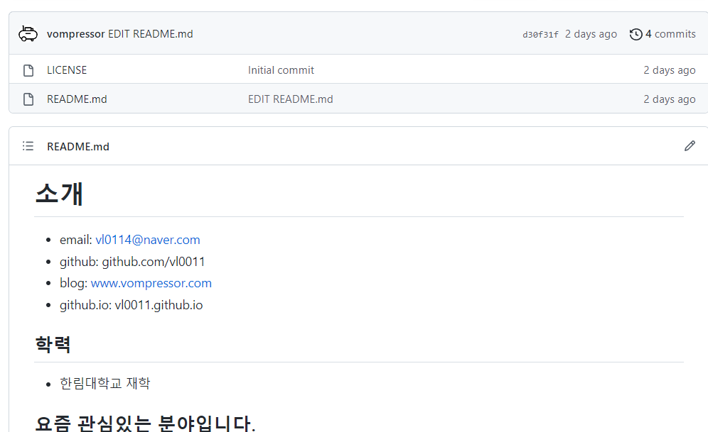
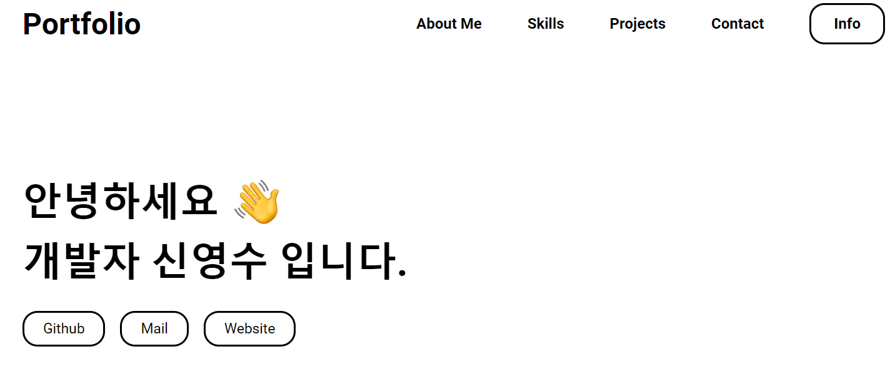

# 오픈소스 SW 개발도구활용

## 기본과제4

### 20185138 신영수

---

## 과제1. README.md

> https://github.com/vl0011/vl0011


`GitHub`에서 보인 `ID`의 리포지토리는 자신의 계정에 최상단에 노출되는 자기 소개 리포지토리 입니다.  
이 리포지토리에서는 간단한 본인 소계정도만 작성하고, 저의 `github.io`와 개인 블로그 링크를 남겨두었습니다.

---

## 과제2. github.io

> https://vl0011.github.io  
> https://github.com/vl0011/vl0011.github.io



`React`기반 정적 웹사이트 생성 프레임워크인 `Gatsby`를 사용해서 페이지를 작성했습니다.

```
다음과 같은 이유로 `Gatsby`를 사용 했습니다.
- 페이지를 github.io에 표현 가능하도록 빌드 가능
- 강력한 `React`의 기능을 사용할 수 있음
- 친숙한 Javascript를 사용
```

`MIT-License`로 배포되는 [gatsby-starter-portfolio-minimal-theme](https://www.gatsbyjs.com/starters/konstantinmuenster/gatsby-starter-portfolio-minimal-theme)
테마를 수정하여 작업했습니다.
